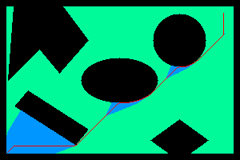

# A* Algorithm

Implementation of the A* path planning algorithm for a rigid robot navigating a 2D obstacle map.

---

## Table of Contents

- [Overview](#overview)
- [Python Implementation](#python-implementation)
- [C++ Implementation](#c-implementation)

---

## Overview

The algorithm finds the optimal path for a robot from a start position to a goal position on a 300×200 map containing the following obstacles: circle, ellipse, two triangles, a rhombus, a square, and a rod. The robot has a configurable radius and obstacle clearance.

---

## Python Implementation

### Requirements

Install dependencies using the system package manager:

```bash
sudo apt install python3-opencv python3-numpy
```

### Running

```bash
cd Python
python3 main.py
```

You will be prompted to enter the following parameters:

```
--- Robot Parameters ---
  Robot radius       (int, >= 0) :
  Obstacle clearance (int, >= 0) :

--- Start Position ---
  Start row   (float, <min> – <max>) :
  Start col   (float, <min> – <max>) :
  Start angle (int, 0/30/60/.../330) :

--- Goal Position ---
  Goal row    (float, <min> – <max>) :
  Goal col    (float, <min> – <max>) :
```

> **Note:** The valid position range is shown dynamically based on the radius and clearance entered. Start and goal positions must lie within this range and outside any obstacle.

### Parameter Reference

| Parameter | Type | Constraints |
|-----------|------|-------------|
| Robot radius | int | >= 0 |
| Clearance | int | >= 0 |
| Start / Goal row | float | `1 + radius + clearance` to `200 - radius - clearance` |
| Start / Goal col | float | `1 + radius + clearance` to `300 - radius - clearance` |
| Start angle | int | Multiple of 30, range 0–330 |

### Output

Results are saved to the `output/` folder:

| File | Description |
|------|-------------|
| `astar_algoritm_in_python.avi` | Animated video of exploration and path |
| `astar_python_path.png` | Final frame showing the complete path |

### Example

Parameters used:


Result:



---

## C++ Implementation

### Requirements

- CMake >= 3.14
- A C++17-compatible compiler (GCC 8+, Clang 7+, MSVC 2017+)
- OpenCV

Install OpenCV on Ubuntu/Debian:

```bash
sudo apt install libopencv-dev
```

### Building

```bash
cd CPP
mkdir -p build && cd build
cmake ..
cmake --build .
```

The compiled binary is placed at `CPP/bin/astar_cpp`.

To rebuild after code changes (no need to re-run `cmake ..`):

```bash
cd CPP/build && cmake --build .
```

### Running

```bash
./CPP/bin/astar_cpp
```

You will be prompted to enter the following parameters:

```
--- Robot Parameters ---
  Robot radius       (int, >= 0) :
  Obstacle clearance (int, >= 0) :

--- Start Position ---
  Start row   (float, <min> - <max>) :
  Start col   (float, <min> - <max>) :
  Start angle (int, 0/30/60/.../330) :

--- Goal Position ---
  Goal row    (float, <min> - <max>) :
  Goal col    (float, <min> - <max>) :
```

> **Note:** The valid position range is shown dynamically based on the radius and clearance entered. Start and goal positions must lie within this range and outside any obstacle.

### Parameter Reference

| Parameter | Type | Constraints |
|-----------|------|-------------|
| Robot radius | int | >= 0 |
| Clearance | int | >= 0 |
| Start / Goal row | float | `1 + radius + clearance` to `200 - radius - clearance` |
| Start / Goal col | float | `1 + radius + clearance` to `300 - radius - clearance` |
| Start angle | int | Multiple of 30, range 0–330 |

### Output

Results are saved to the `output/` folder:

| File | Description |
|------|-------------|
| `astar_algoritm_in_cpp.avi` | Animated video of exploration and path |
| `astar_cpp_path.png` | Final frame showing the complete path |

---
